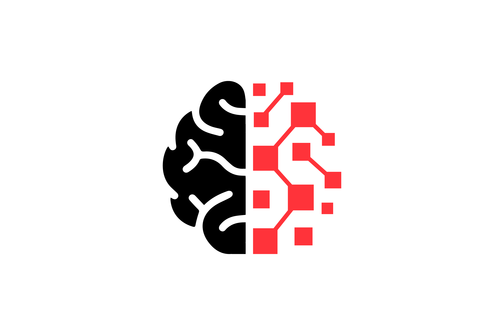

<div class="hero-logo">
  
</div>

# One Mind Codex

> **The AI-native operating system for your life. Built for humans + AI.**
>
> By Zeus Delacruz | Public vault | Status: ACTIVE — updated regularly

---

## What This Is

This is my **public codex** — a real, working knowledge vault built on the One Mind framework. It's the same system I use privately, shared openly so my community can see exactly how it works and fork it to build their own.

Think of it as watching me build in real time. I update this as I work. You can use it as your starting point.

**This is not a tutorial. It's a living system.**

---

## The One Mind Framework

One Mind is an AI-native life operating system. Unlike GTD, PARA, or Second Brain — which were built for humans working alone — One Mind is designed for **humans and AI working together**. The system has one core method:

```text
C → O → D → E → X
Capture → Organize → Direct → Execute → eXamine
```

The vault is divided into 4 quadrants covering every domain of life:

```text
00-24  UI  — Unified Intelligence   (AI, tech, infrastructure)
25-49  HP  — Holistic Performance   (health, money, identity, skills)
50-74  LE  — Legacy Evolution       (family, home, estate)
75-99  GE  — Generational Entrepreneurship (business, ventures, wealth)
```

---

## How to Use This

### Option 1 — Get Your Own Copy

1. Go to the **[OneMind Codex Template](https://github.com/OneMind-OS/onemind-codex-template)** on GitHub
2. Click the green **"Use this template"** button → **"Create a new repository"**
3. Open your new repo folder in [Obsidian](https://obsidian.md) (free)
4. Read `_codex/INTERFACE.md` — it explains everything to you (and your AI)
5. Start with the quadrant that matters most to you right now
6. Replace my examples with your own life

> The template vault always matches what you see on this site — it syncs automatically.

### Option 2 — Just Watch and Learn

Browse the domains. Read how I structure my notes, make decisions, run reviews. Take what's useful.

### Option 3 — Use the Templates

Every note type has a template in `_codex/templates/`. Copy the template, fill it in, save it in the right domain folder. That's the whole system.

---

## Folder Structure

```text
codex-live/
├── _codex/                          ← System infrastructure (start here)
│   ├── INTERFACE.md                 ← Universal agent/human entry point
│   ├── CONVENTIONS.md               ← Naming, frontmatter, tagging rules
│   ├── templates/                   ← Note type templates
│   ├── skills/                      ← How-to procedures for agents
│   ├── system/                      ← Always-loaded context (pinned)
│   └── profiles/                    ← Review cadence profiles
│
├── 00-24 UI (Unified Intelligence)/ ← AI, tech, infrastructure
│   ├── 00 Framework (Doctrine)/     ← Core principles
│   ├── 01 Command (Dashboard)/      ← Navigation + dashboards
│   ├── 02 Agents (AI & Tools)/      ← Agent configs, memory
│   ├── 03 Protocols (SOPs)/         ← Standard procedures
│   ├── 06 Inbox (Queue)/            ← Unsorted capture
│   ├── 08 Infrastructure/           ← Servers, APIs, services
│   ├── 09 Automation/               ← Workflows
│   └── 10 Development/              ← Code, testing
│
├── 25-49 HP (Holistic Performance)/ ← Self optimization
│   ├── 25 Identity/                 ← Who you are, values, purpose
│   ├── 27 Body/                     ← Health, fitness, nutrition
│   ├── 28 Mastery/                  ← Skills, career, learning
│   ├── 29 Life Systems/             ← Routines, daily ops
│   ├── 30 Finance/                  ← Money, investments
│   ├── 32 Relationships/            ← Social, network
│   └── 33 Joy/                      ← Fun, travel, recreation
│
├── 50-74 LE (Legacy Evolution)/     ← Family + home
│   ├── 50 Home/                     ← Property, environment
│   ├── 51 Partnership/              ← Relationships
│   ├── 52 Children/                 ← Parenting
│   ├── 55 Health/                   ← Family wellness
│   └── 56 Wealth/                   ← Estate, assets
│
├── 75-99 GE (Generational Entrepreneurship)/ ← Business
│   ├── 75 Personal Brand/           ← Your public identity
│   ├── 76 Education/                ← Teaching, courses
│   ├── 80 Treasury/                 ← Business finance
│   ├── 81 Strategy/                 ← Planning, analytics
│   └── 84 Ventures/                 ← New ideas, innovation
│
├── assets/                          ← Images and media
├── CODEX-FRAMEWORK.md               ← The method (full doctrine)
└── ONEMIND-CODEX.md                 ← Master overview document
```

---

## Start Here

If you're new: **read [`_codex/INTERFACE.md`](_codex/INTERFACE.md) first.**

If you're an AI agent assigned to this vault: same answer — `_codex/INTERFACE.md` tells you everything.

---

## Community

This vault is part of the **One Mind** community. If you're here, you're building something real.

- Learn the framework: [onemindcodex.com](https://onemindcodex.com)
- Follow the build: [@zeusdelacruz](https://zeusdelacruz.com)

---

## License

MIT — fork it, remix it, build on it. Credit appreciated, not required.
